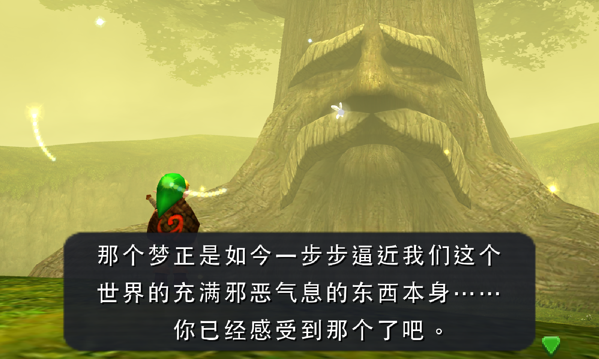

## Description
This script generates high resolution text for The Legend of Zelda Ocarina of
Time 3D, to be used with the Citra 3DS emulator. Citra includes support for
replacing low resolution textures with high resolution alternatives. In most
games, this functionality makes it straightforward to obtain high resolution
text by replacing a small number of font textures. However, Ocarina of Time has
an unusual text implementation in which every time a text string is displayed
the game generates an image including one instance of each unique character in
the string. This behavior is presumably inherited from the Nintendo 64 version,
on which it may have been useful for conserving memory. The script works around
this behavior by:

1. Loading text image from the directory to which Citra saves textures
2. Parsing each text image into its component characters
3. Writing new high resolution text images to the load directory from which
   Citra loads replacement textures

The script scans for text images as the game is played. The first time a text
string is displayed it will be low resolution, but the next time that same
string is reloaded for display it will be replaced with a high resolution
version. Playing through the complete game should therefore yield a set of high
resolution text images that cover most displayed text.

    
    <h3>Original</h3>
     
    
    <h3>High-Resolution Text</h3>

**Unfortunately**, the North American, European, and Japanese localizations 
have a behaviour that sharply limits the usefulness of this script: they do not
fully clear the text image between uses. If string A with 15 unique characters
is displayed, followed by string B with 20 unique characters, and then string A
again, two unique text images will be generated for string A. The first will
include string A's 15 unique characters, and the second will include string A's
15 unique characters followed by string B's 16th through 20th characters. Thus,
the text image of a string depends on the contents of the strings viewed
previously, vastly increasing the number of potential text images. This is
difficult to work around without modifying either the internals of the game or
Citra, and limits the usefulness of the script for these localizations. It is
still fully functional, but in practice a relatively small portion of displayed
text will be high resolution.

**Fortunately**, the Chinese localization, for which this script was originally
designed to be used, clears the text image between usages, making it viable to
generate a high resolution text package for this language. This script is
particularly useful for Chinese, as the original 16x16 pixel resolution is
ill-suited for complex characters. A simplified Chinese high resolution text
package covering most of the game text has been created and is available on the
release page. The script may be run while playing the Chinese localization to
capture any additional text missing from the package.

## Usage

## Machine Learning-Powered Optical Character Recognition

## License
